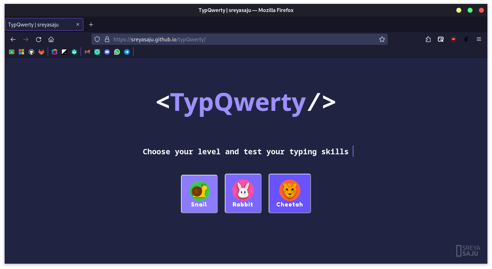
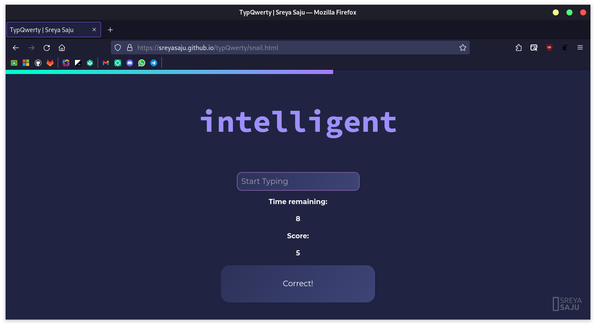
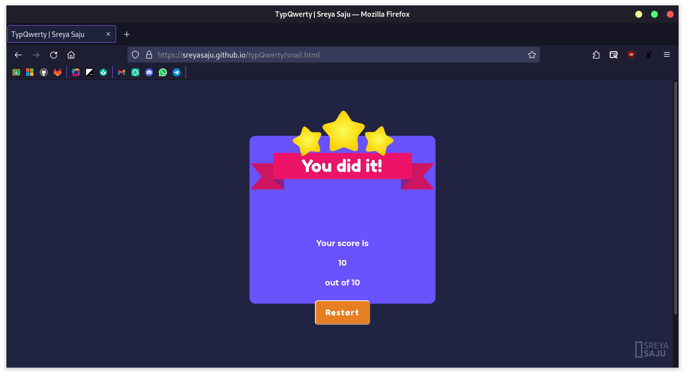

 
<h1 align="center"> typQwerty</h1>

 A minimal typing test game 

 

## About the Project ✨

typQwerty is a simple and minimal typing test game. The number of words and timer is set according to the level chosen by the user. The difficulty of the words increases with the levels. The score is displayed at the end of the game. The user has to select between the
three levels of the game namely: Snail 🐌, Rabbit 🐰, Cheetah 🐆,
